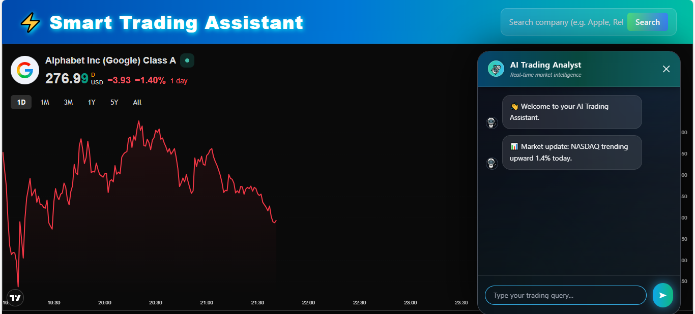

# 💹 Trading-Assistant

An AI-powered financial analysis and trading platform. It uses **LangGraph** to coordinate specialized agents for market research, technical analysis, and sentiment tracking.



## 🏗️ Project Architecture

```text
Trading-Assistant/
├── agents/             # Modular agent classes (Data, AI, Trading)
├── nodes/              # LangGraph units (Sentiment, Risk, Macro, etc.)
├── graphs/             # DAG pipelines (Dual & Trading logic)
├── utils/              # API clients for Market & News data
├── core/               # Pydantic schemas and shared state
├── model/              # LLM integration (Gemini)
├── backend/            # Python/FastAPI logic
└── frontend/           # React user interface
```

-----

## 🛠️ Getting Started

### 1\. Setup Environment Variables

Create a `.env` file in the root directory and add your keys:

**Backend Keys:**

  * `GEMINI_API_KEY`: Main LLM reasoning engine.
  * `NEWSAPI_API_KEY`: Real-time news sentiment data.
  * `ALPHA_VANTAGE_API_KEY`: Stock fundamentals and indicators.
  * `FINNHUB_API_KEY`: Market data and company news.
  * `FRED_API_KEY`: Macro-economic data (interest rates, GDP).
  * `TWELVE_API_KEY`: Real-time stock prices and ETFs.

**Frontend Keys:**

  * `REACT_APP_GROQ_API_KEY`: Fast inference for chatbot UI components.

### 2\. Execution

**Backend**

```bash
python -B main.py
```

**Frontend**

```bash
cd frontend
npm start
```

-----

## 🚀 Key Features

  * **Multi-Agent Intelligence:** Specialized agents for Data Collection, AI Analysis, and Trade Execution.
  * **Complex Reasoning:** LangGraph nodes to process intent, parse queries, and calculate technical indicators like RSI and MACD.
  * **React Frontend:** Modern dashboard with a **ChatBotWidget** and **TradingView** integration.
  * **Risk & Macro Analysis:** Automated calculation of portfolio risk and global market trend detection.

